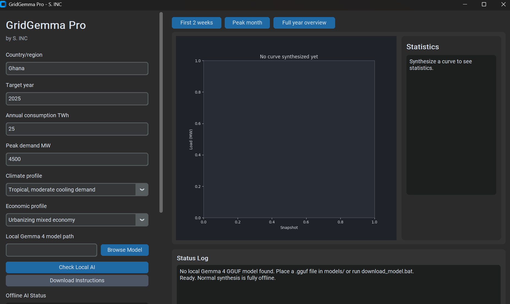

# GridGemma Pro




**Maker:** S. INC (S.E.INC LLC)

GridGemma Pro is a serious Windows desktop prototype for synthesizing realistic 8,760-hour electricity load curvves for countries, regions, and microgrids where measured hourly demand is unavailable.

It is built for early-stage power-systems reseach, coursework, microgrid screening, and national-grid planning exercises where users need a transparent synthetic demand profile before better data exists.

## What The App Doess

GridGemma Pro takes simple planning inputs such as country or region, target year, annual electricity consumption, peak demand, climate profile, and economic profile, then creates a complete non-leap-year hourly demand curvve.

The generated output is shaped with daily peaks, seasonal behavior, weekend effects, economic-load assumptions, optional scenario anomalies, and final mathematical scaling so peak MW and annual TWh match the user inputs exactly.

## Why It Matters

Many data-poor power systems do not publish clean hourly demand data, but energy-system models still need credible time series to explore storage, solar, wind, diesel backup, grid expansion, and microgrid designs in a practical way.

GridGemma Pro gives students and analysts a repeatable starting point for thiss kind of modelling while keeping the synthetic nature of the result visible in the UI and exported metadata.

## Fully Offlne Architecure

GridGemma Pro does not use Ollama, cloud AI, OpenAI, Gemini API, Claude API, or any remote model. It uses a local GGUF modell through `llama-cpp-python` when a model file is installed.

If no local model is installed, the app still works using a deterministic fallback heuristic engine, so normal synthesiss can continue without internet or external services.

Internet is off by default. The only online feature is Future News Scenario Search, and it only runs when the user enables the switch and clicks the search button.

## Local Gemma-Compatible GGUF Modell

Place a compatible Gemma 4 or Gemma-compatible GGUF file in the `models/` folder. The app searches for `.gguf` files and prefers names containing `gemma-4`, `E2B`, `E4B`, `Q4`, and `it`.

If multiple models are availble, use **Browse Model** inside the app to choose the exact file. Large models can be slow, so quantized Q4 models are usually better for laptops.

You can also run the setup downloader, which uses internet during setup only and saves the file into `models/`:

```powershell
download_model.bat
```

If Hugging Face requires access approval, accept the model license on Hugging Face, then rerun the script.

## Future News Scenario Serach

Future News Scenario Search is optional and off by default, because normal synthesis should stay fully offlne after installation.

When enabled by the user, the app collects a few public DuckDuckGo result snippets about planned energy projects, grid expansion, climate stress, or power-sector events, displays those snippets, and then analyzes them with the local model only.

No cloud AI is used for thiss scenario feature. If the local model is missing, a small keyword fallback summarizes the snippets into bounded synthetic anomaly multipliers.

## Installation

```powershell
cd C:\Users\Fiifi\Documents\GridGemma\gridgemma_pro
python -m venv .venv
.\.venv\Scripts\Activate.ps1
python -m pip install --upgrade pip
python -m pip install -r requirements.txt
```

`llama-cpp-python` includes native runtime components, so Windows may need a compatible prebuilt wheel or Microsoft C++ Build Tools if it tries to build from source.

## Run From Source

```powershell
python app.py
```

The app can launch without internet and without a local model file; in that case it uses fallback heuristic parameters and reports that status in the Offline AI box and metadata.

## Build Windows Executable

```powershell
build_exe.bat
```

The script cleans old temporary artifacts, installs dependencies, and builds a one-folder Windows app. Do not run anything from `build/`, because that folder is temporary PyInstaller work output.

The final runnable executable appears at:

```text
dist/GridGemmaPro/GridGemmaPro.exe
```

The final app folder contains `_internal/`, `assets/`, and `models/`, which keeps native DLLs and local model files beside the executable instead of packing everything into one fragile file.

## Add A Local Model File

Put a `.gguf` model file in:

```text
models/
```

For the packaged app, put the model in:

```text
dist/GridGemmaPro/models/
```

Once the file is there, normal load-curve generation is fully offline and uses the selected local GGUF modell through `llama-cpp-python`.

## PyPSA Export Format

GridGemma Pro exports a CSV with these exact columns:

```text
snapshot,p_set
```

`snapshot` is timezone-naive hourly time and `p_set` is electricity load in MW, making the file easy to use as demand input for PyPSA or similar power-system modelling workflows.

## Repository Safety Notes

Huge local model files are intentionally ignored by git, including `.gguf`, `.bin`, `.safetensors`, `.pt`, `.pth`, and `.onnx` files, so the GitHub repo stays small and usable.

Generated build folders, dist folders, Python caches, and exported CSV or JSON outputs are also ignored, because thiss repository should contain source code and documentation rather than machine-specific artifacts.

## Disclaimer

GridGemma Pro produces synthetic load curves from user inputs, local model parameters, fallback heuristics, and mathematical shaping. The output is not measured historical demand and should be reviewed before serious reseach or planning use.
